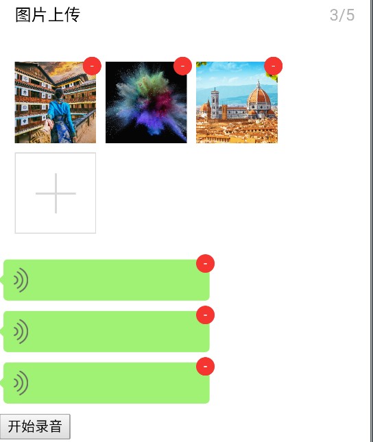
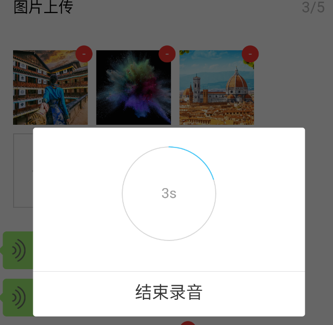

## 微信jssdk vue组件

## 相关依赖
- jweixin-1.2.0.js

## 所有组件

- ST_IMAGE_UPLOADER 图片上传组件
  - props 
    - v-modal `[{serverId:'',url:'localId||url',localId:''}]`
  
- ST_VOICE_UPLOADER 语音上传组件
  - props 
    - v-modal `[{serverId:'',url:'localId||url',localId:'',duration:2}]`
      - duration 时长（单位s）
  - methods
    - stShowRecord 打开录音弹窗
    
## 如何使用

js
```javascript

  import Vue from "vue"
  import StWx , {jsApiList} from 'st_wx'
  Vue.use(StWx)
  
  export default {
      name: 'PageStWx',
      data () {
        return {
          images: [],
          voices: []
        }
      },
      created(){
          const vm = this
          // 初始化wx jssdk $wx jssdk组件（自动注入）
          vm.$wx.config({ 
            "appId": "",
            "nonceStr": "",
            "signature": "",
            "timestamp": "",
            "url": "",
            "jsApiList":jsApiList
          })
      }
  }
  
```
html

```html

  <st-image-uploader ref="imageUploader" v-model="images"></st-image-uploader>
  
  <button @click="$refs.imageUploader.stShowRecord()">上传图片</button>
  
  <st-voice-uploader ref="voiceUploader" v-model="voices"></st-voice-uploader>
  
  <button @click="$refs.voiceUploader.stShowRecord()">开始录音</button>
  
```

## 效果图



